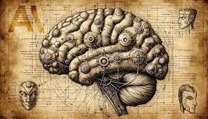
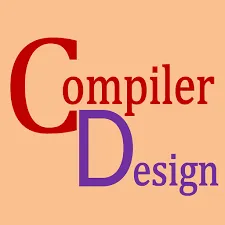

# Hello ladies and gentlemen, I'm 3laa 👋

**AI Engineer** | Future **AI Consultant** | Founder @ *Klysus* (Not yet but am working on it :>)

I'm an AI engineer focused on real-world GenAI applications — especially agentic systems. Currently building deep expertise in LLMs, prompt engineering, and full-stack AI workflows. Long-term vision: launch **Klysus**, my own AI solutions company.

---

## 🧠 Current Focus

- Designing **agentic AI systems** and autonomous workflows  
- Developing LLM-based tools using **Python** and modern frameworks  
- Engineering solid prompt strategies for production GenAI  
- Studying how **hardware principles** and **low-level systems** affect AI performance  
- Exploring software architecture, **cybersecurity fundamentals (AISS)**, and systems thinking  

---

## 🧰 Toolbox

- **Languages**: Python, SQL, Bash  
- **AI/ML**: PyTorch, HuggingFace Transformers, LangChain  
- **Data**: MongoDB, Pandas, JSON, SQL (Honestly, whatever DBMS I need — I’ll learn it and master it 😎)  
- **Infra/Dev**: GitHub Actions, CLI tools, APIs, FastAPI  
- **Security**: AISS-level cybersecurity knowledge, systems hygiene, basic exploit theory  

---

## 🚀 Goals

- 🧩 Build and launch **Klysus** — an AI solutions company focused on practical, secure, and scalable GenAI tools  
- 🔧 Grow into **AI consulting** as a service layer within Klysus — helping teams integrate agentic AI with real business value  
- 📚 Keep combining deep knowledge in **software, hardware, and cybersecurity** to design smarter, more autonomous systems  

---

## 📚 Research & Essays

  <a href="https://medium.com/@allakink64/its-all-just-zeros-and-ones-so-how-does-ai-actually-learn-9e83a9c75492" target="_blank" style="text-align: center; max-width: 260px;">
    
    
<strong>🧠 How AI Actually Learns</strong> Breaking down how neural nets make sense of 0s and 1s.

  </a>

  <a href="https://medium.com/@allakink64/the-hidden-architect-of-code-understanding-the-compilers-role-in-translating-to-machine-language-cd5e401307a4" target="_blank" style="text-align: center; max-width: 260px;">
    
    
<strong>🏗️ Understanding Compilers</strong> How your code turns into raw machine logic.

  </a>

  <a href="https://medium.com/@allakink64/why-jordanian-companies-are-slow-to-adopt-ai-and-emerging-technologies-and-what-can-be-done-1a19f64c18b3" target="_blank" style="text-align: center; max-width: 260px;">
    
    
<strong>🇯🇴 AI Adoption in Jordan</strong> Why companies hesitate — and what we can do about it.

  </a>

---

## 📬 Contact

Want to connect, collab, or nerd out about agentic AI? Hit me up:

- 🐙 GitHub: [@Eias02](https://github.com/Eias02)  
- 📧 Email: **alaa_salamah02@yahoo.com**  
- 💼 LinkedIn: [Alaa Salamah](https://www.linkedin.com/in/alaa-salamah-96167b227/)  

---

> “Engineering isn’t about tools — it’s about clarity of thought and solving the right problem.”
